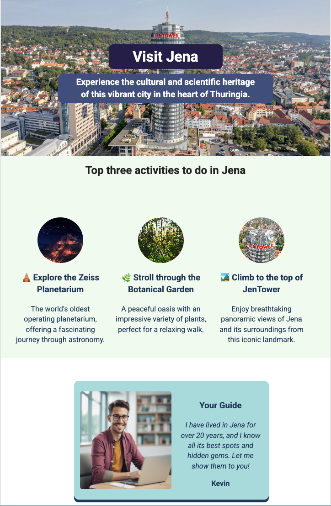

# Visit Jena

  

A modern and responsive website showcasing the city of Jena, Thuringia, and its top tourist attractions.



## Table of Contents

- [Overview](#overview)
- [Technologies Used](#technologies-used)
- [Installation](#installation)
- [Project Structure](#project-structure)
- [Responsive Design](#responsive-design)
- [Contribution](#contribution)
- [License](#license)

## Overview

This project is a static website designed to promote tourism in Jena, featuring:
- A visually appealing introduction to the city
- The top three recommended attractions (Zeiss Planetarium, Botanical Garden, Jena Tower)
- A local tourist guide

The site is fully responsive, providing an optimized experience for desktops, tablets, and mobile devices.

## Technologies Used

- HTML5 / CSS3
- JavaScript
- Webpack for bundling and compilation
- HTML5 Boilerplate as the base structure
- Google Fonts (Roboto)

## Demo

View the live demo [here](https://hometown.kevinngongang.dev/).

## Installation

```bash
# Clone the repository
git clone https://github.com/bakadja/hometown-homepage.git
cd hometown-homepage

# Install dependencies
npm install

# Start the development server
npm start

# Build for production
npm run build
```

## Project Structure

```
hometown-homepage/
├── css/
│   ├── main.css       # Main site styles
│   ├── responsive.css # Media queries for responsiveness
│   └── style.css      # Base styles (HTML5 Boilerplate)
├── img/               # Site images
│   ├── jenatower-bg.webp
│   ├── zeiss-planetarium.jpg
│   ├── botanische-garden.jpg
│   ├── jenaTower.webp
│   └── about.png
├── js/
│   └── vendor/        # External scripts
├── index.html         # Main page
├── 404.html           # Error page
├── webpack.common.js  # Common Webpack configuration
└── webpack.config.prod.js # Webpack production configuration
```

## Responsive Design

The site adapts to different screen sizes:
- **Desktop**: Full experience with a horizontal layout
- **Tablets (768px to 991px)**: Adjusted margins and content
- **Small tablets (576px to 767px)**: Resized text and reorganized activity cards
- **Mobile (up to 575px)**: Optimized vertical layout, resized images
- **Landscape mode on mobile**: Specific layout adjustments

## Contribution

Contributions are welcome! To contribute:
1. Fork the project
2. Create a new branch (`git checkout -b feature/improvement`)
3. Commit your changes (`git commit -m 'Added a new feature'`)
4. Push to the branch (`git push origin feature/improvement`)
5. Open a Pull Request

## License

This project is licensed under the MIT License. See the [LICENSE](LICENSE) file for details.

---

Developed with ❤️ to promote the beautiful city of Jena.
